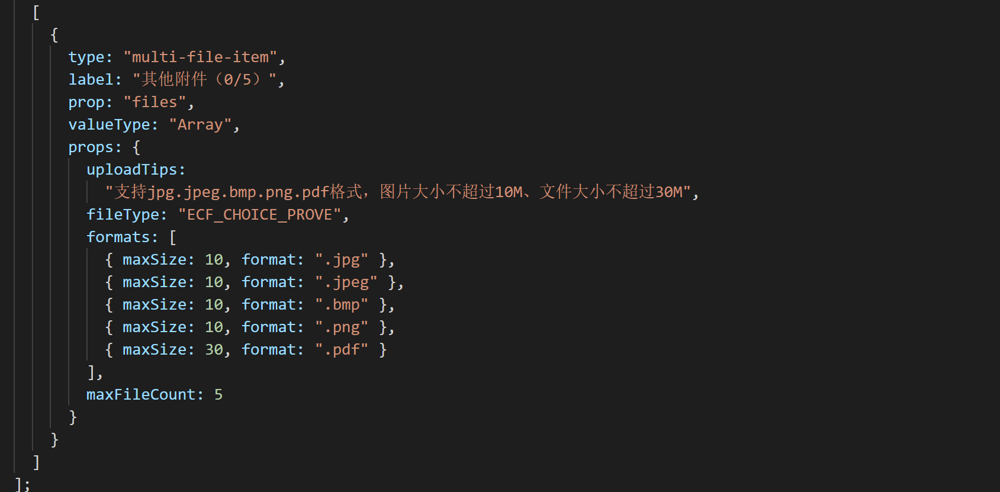

# vue-dy-form

> vue 双向绑定动态表单

> [原理讲解一](https://mp.weixin.qq.com/s?__biz=MzIwNjc5ODA1Mw==&mid=2247484036&idx=1&sn=13bfaf51533bb5b0e7d448a2f7a8ab60&chksm=971d6f0ea06ae618fb65b414ac2733feb76fb02fe71a74891d4165cd6c8b56ab0f28b9d53fff&token=181237259&lang=zh_CN#rd)

> [原理讲解二](https://mp.weixin.qq.com/s?__biz=MzIwNjc5ODA1Mw==&mid=2247484043&idx=1&sn=34c2bd62cbb2e2e89667aab9e74e4418&chksm=971d6f01a06ae617990b7c367547a6bd2b08df72f75ddfd775ff817b2091a5812dd53d8a01c7&token=181237259&lang=zh_CN#rd)

> [原理讲解三](https://mp.weixin.qq.com/s?__biz=MzIwNjc5ODA1Mw==&mid=2247484050&idx=1&sn=3a1d6ef251e74063e2658577374f6edb&chksm=971d6f18a06ae60eb6446021b76f5bb138094e9b66eb181917612ffd1055e1542c0c89a15b79&token=181237259&lang=zh_CN#rd)

> [原理讲解四](https://mp.weixin.qq.com/s?__biz=MzIwNjc5ODA1Mw==&mid=2247484061&idx=1&sn=a4bd911675b0fc3a90dfc4d451e0f42b&chksm=971d6f17a06ae601d4fcbc8a0c3a35010c36ce0ca3983fd0d63d5ab4a4056cc4da945cdc31fd&token=181237259&lang=zh_CN#rd)

> 使用效果图


> 使用方法 .vue


> 配置方法 .js


## 自定义组件

  

  

  

  

  

## Build Setup

``` bash
# install dependencies
npm install

# serve with hot reload at localhost:8080
npm run dev

# build for production with minification
npm run build

# build for production and view the bundle analyzer report
npm run build --report
```

For a detailed explanation on how things work, check out the [guide](http://vuejs-templates.github.io/webpack/) and [docs for vue-loader](http://vuejs.github.io/vue-loader).

